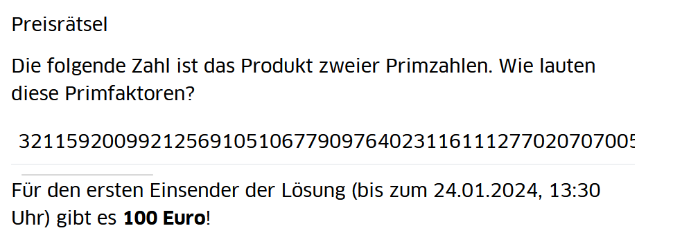

# Über das Projekt
Ende November 2023 hat mein Professor in dem Modul "Kryptologie" ein Rätsel veröffentlicht:  
Gegeben ist ein $n = p \cdot q$, wobei $p$ und $q$ Primzahlen sind.   
Wer ihm als erstes bis Ende Januar das $p$ und $q$ nennen kann, bekommt von ihm 100 Euro.



Die Sicherheit eines weitverbreiteten Verschlüsselungsalgorithmus (RSA) basiert genau darauf, dass die Lösung einer solchen Aufgabe sehr schwierig ist.

Aus dem Kontext der Vorlesung heraus kann man sich überlegen, dass die Zahl n mit der Software [ARIBAS](https://www.mathematik.uni-muenchen.de/~forster/sw/aribas.html) entwickelt wurde.
```
n := next_prime(random(10**100)) * next_prime(random(10**100)).
```


# Ansätze
## Faktorisieren
Ließe man eine Zahl $p'$ im Bereich $10^99 <= p' < 10^100$ laufen und würde Probedivisionen machen: $n \mod p' = 0$, hätte man einen Aufwand von $10^99$ Probedivisionen. Im Vergleich: Die Anzahl der Atome im Universum liegt bei ca. $10^84$.
Man würde also eine Ewigkeit warten müssen, bis eine Probedivision zum Erfolg führt.
Dies ist natürlich ein sehr naiver Ansatz und es gibt tatsächlich komplizierte Möglichkeiten, eine solch "kleine" Zahl anzugreifen. RSA Zahlen sind heutzutage daher weitaus größer.

## Zufälligkeit angreifen
In manchen Programmen wird ein schlechter Zufall genutzt, sodass man bspw. mit Kenntnis des Startzeitpunkts des Programms, die selben Zufallszahlen, also auch die selben Primzahlen ziehen kann.
Beispiel:
```c
srand(time(NULL)); // time(NULL) gibt die Anzahl der vergangenen Sekunden seit dem Jahr 1970 zurück.
```

Die Überlegung ist nun, ob ARIBAS auch zu solchen Programmen zählt.
Nachforschungen zeigen, dass ARIBAS zwar einen eigenen Zufallsalgorithmus bereitstellt, jedoch für den Seed auf die Berechnung
```c
srand(time(NULL));
aribas_seed = rand();
```
zurückgreift.
Ich möchte mich in dem Zuge auch bei Herrn Prof. Forster bedanken (der Entwickler von ARIBAS). Er hatte mir bei meinen Fragen bezüglich der Implementierung geholfen.

Da ich sicher nicht sagen kann, wann mein Professor sein Programm geöffnet hat (um das n zu berechnen), muss ich stattdessen versuchen den Zeitraum eingrenzen und alle Sekunden in diesem Zeitraum ausprobieren. Leider stellt sich auch das als Schwierigkeit heraus, da das Rätsel schon in den Jahren zuvor gestellt wurde und der Professor nicht sagen wollte, wann er das Rätsel das erste mal gestellt hat.
Ist der Bruteforce Algorithmus jedoch schnell genug, kann man einfach ein paar Jahre (jeweils im Zeitraum zwischen November und Dezember) durchtesten und den Rechner einen Tag durchlaufen lassen. Der Aufwand, um 5 Jahre durchzutesten, sollte in der Größenordnung 2^24 bzw. 10^8 liegen (Anzahl an Primzahlberechnungen "next_prime"). Das sind also nur ein paar Millionen Möglichkeiten (was sehr viel besser machbar ist).

Da mir ARIBAS selbst zu langsam war und keine Funktionen zu Parallelisierung von Berechnungen bereitstellt, habe ich mich kurzerhand dazu entschlossen, den Zufallsalgorithmus nachzuimplementieren.
Ich musste mich ein wenig in dem Source Code von Herrn Forster zurechtfinden. Schließlich hatte ich dann aber einen guten Überblick und konnte auch eigene Funktionen in das Programm hinein implementieren, sodass mir das Debugging einfacher fiel. 

Da ich dafür zur Programmiersprache Rust gehen wollte (weil ich diese einerseits cool finde und ich andererseits keine gute Bibliothek für Benutzung riesiger Integerzahen in C++ gefunden habe) musste ich also auch das `srand()` und `rand()` selbst implementieren.
Im ersten Versuch wollte ich in C den Code als Bibliothek exportieren und an Rust weitergeben. Jedoch hat das auch nach vielem Hin und Her nicht richtig geklappt und ich gab diesen Ansatz auf.
Mit dem Ansatz der Bibliothek hätte ich zudem das Problem, dass `rand()` einen globen Zustand hat, was für die Parallelisierung nicht gerade von Vorteil wäre.  
Spätere Nachforschungen zeigten zudem, dass die Implementierung dieser Funktionen sehr von der Wahl des Betriebssystems und des Compilers abhängt. Für meine Zwecke war es essenziell, dass es der Umsetzung von GCC auf Windows gleicht.

Nun habe ich mich also dazu entschlossen, die Implementierung vollständig selbst umzusetzen. Die tatsächliche Implementierung zu finden stellte sich aber als große Herausforderung heraus. Ich habe mir den Source Code von glibc geholt und versucht nachzuvollziehen, wie dort die Implementierung umgesetzt wurde.
Nach vielem hin und her habe ich es dann endlich geschafft.  
Sehr viel später stellte sich dann heraus, dass das die Implementierung auf Linux ist (dies ist mir nicht aufgefallen, da ich aus Komfortgründen viel in der WSL Konsole arbeitete) und mein Angriff somit im Grunde nie funktionieren konnte (außer als ich die Zufallszahl mit einem ARIBAS in Linux generiert habe).
Zum Glück konnte mir ein Kommilitone helfen, der eine Python Implementierung der Windowsvariante im Internet fand.

Während ich noch mit der Linuxvariante gearbeitet habe, implementierte ich dann nun auch den Zufallsalgorithmus von ARIBAS selbst. Auch dort hatte ich hier und da Probleme, weil ich die Implementierung ein wenig anders und "moderner" lösen wollte, als es im ARIBAS Code gemacht wurde.

Nach vielem Hin und Her funktionieren nun beide Zufallsgeneratoren zuverlässig. Der hier zur Verfügung gestellte Code bietet jeweils eine Variante für Linux und Windows an (konkret müsste die Zeile 208 in [bruteforce.rs](src/bruteforce.rs) die Linux Variante instanziieren).

Ich habe mich am Code für den Bruteforce Algorithmus dann schließlich auch ziemlich lange aufgehalten, weil ich eine Progressbar haben wollte. Am Ende entschied ich mich dann doch dagegen, damit ich mehr Informationen über den Verlauf sehen konnte (und weil ich nicht noch mehr Zeit verlieren wollte).
Nach dem Festlegen einer Zeitspanne wollte ich das Programm nun über Nacht laufen lassen... Um nach 3 Minuten festzustellen, dass es bereits ein Ergebnis gibt:

**DAS RÄTSEL WAR GELÖST**

Am nächsten Tag tauschte ich mich noch mit meinem Kommilitonen aus. Wir sind darauf gekommen, dass die Wahl einer Zeitspanne ziemlich unrelevant war, da die Implementierung von `rand()` in Windows nur $2^15$ Ausgaben haben kann.

In der finalen Version werden nun einfach alle Möglichkeiten von `0` bis `0x7fff` ausprobiert. Erfahrungsgemäß dauert ein Angriff bis zu zwei Minuten.

# Selbst ausprobieren
In der Datei [main.rs](src/main.rs) ist die Zahl in der Zeile 33 das `n`.
Nach der Installation von Rust kann man dann den Befehl
```shell
cargo run --release
```
ausführen und auf das Ergebnis warten.